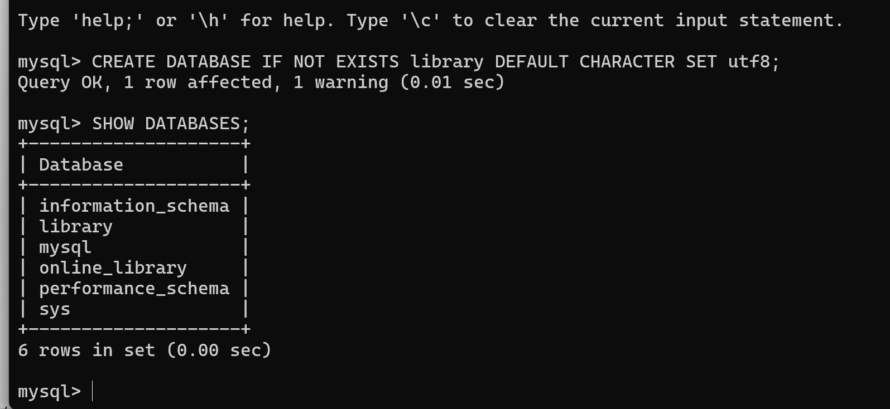
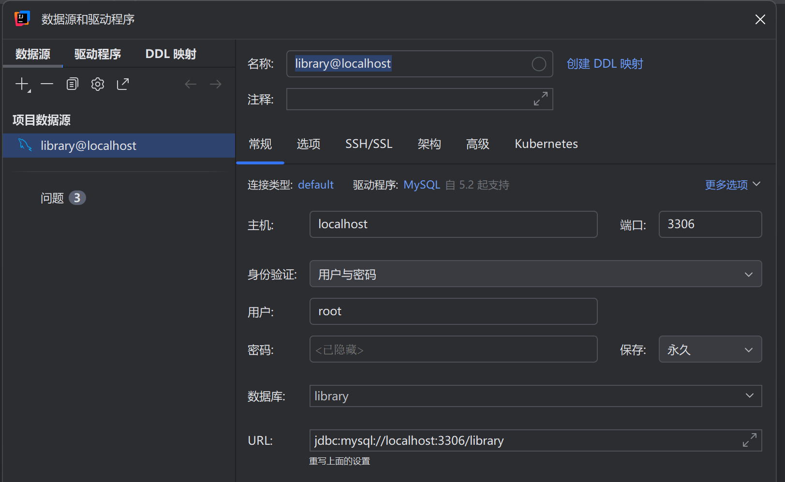
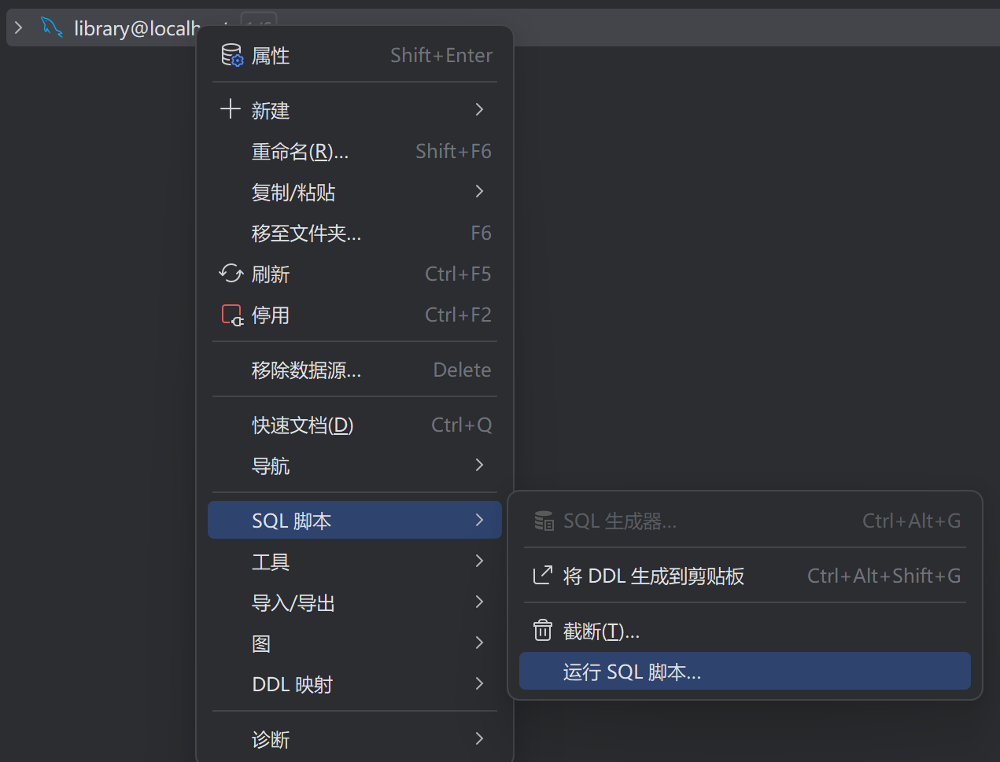
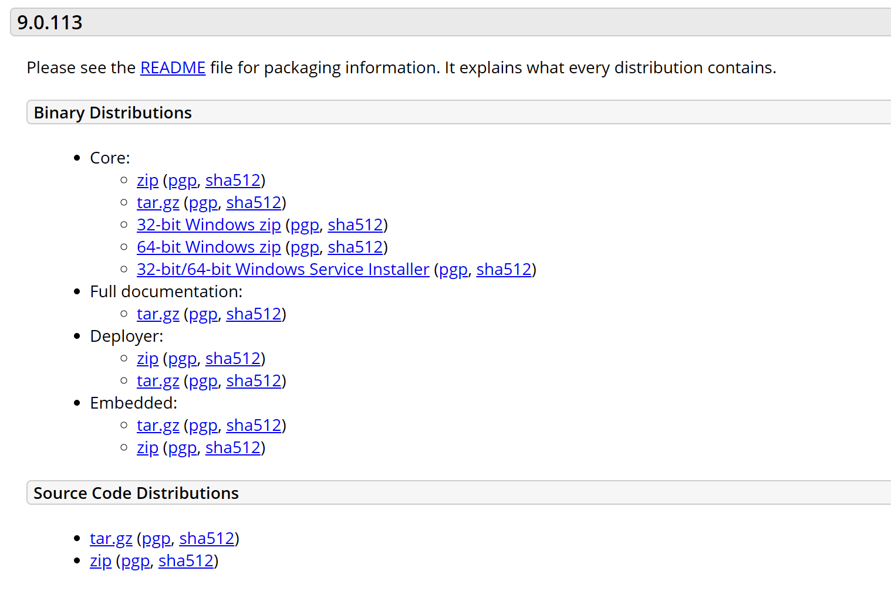
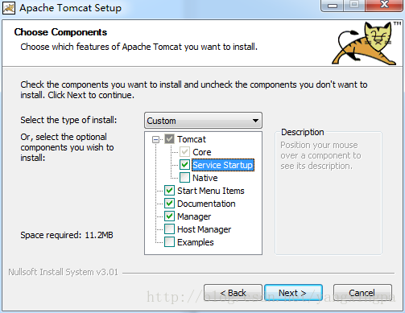
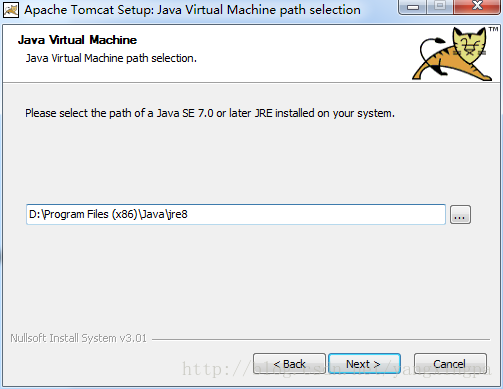
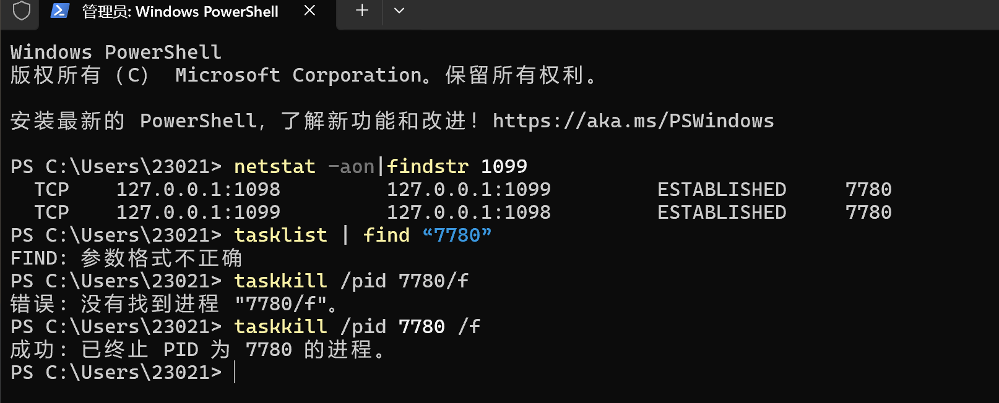

# Library Web 项目 部署运行全流程 README

## 概述

本文档详细记录了 Library Web 项目在 IDEA 中配置 Tomcat 并部署运行的全流程，包含数据库配置、环境安装、IDEA 配置、常见问题解决及登录信息，确保项目可正常启动并使用。

项目地址：https://github.com/Lain-Ego0/FJUT-WebMySQL

## 一、前置环境要求

1. JDK：版本不低于 1.8，需提前完成配置与环境变量设置
2. MySQL：本地版本为 5.x 系列，推荐 5.7 及以上版本
3. Tomcat：推荐 Tomcat 9 版本（本文采用 exe 安装版进行配置）

## 二、步骤一：本地 MySQL 数据库配置

### 2.1 新建 MySQL 数据库

打开 MySQL工具（如 Navicat、DataGrip 等），新建数据库，**数据库名称必须为 library**

这里以命令行为例：

#### 执行创建`library`数据库的 SQL 语句

```sql
CREATE DATABASE IF NOT EXISTS library DEFAULT CHARACTER SET utf8;
```

#### 验证数据库是否创建成功（可选）

```sql
SHOW DATABASES;
```



#### 退出 MySQL 命令行

```sql
exit;
```

#### 数据库属性设置如下图所示：



### 2.2 导入 SQL 脚本

选中新建的`library`数据库，执行 SQL 脚本进行数据导入，操作如下图所示：



导入library.sql即可。脚本导入完成后数据库数据配置完毕

### 2.3 修改数据库连接密码

1. 打开项目目录下的数据库连接配置文件：`library\src\com\demo\javabean\DBAccess.java`
2. 在文件中修改数据库连接密码，确保与本地 MySQL 数据库密码一致，保存文件即可

## 三、步骤二：JDK 配置（前置准备）

1. 确认本地已安装 JDK（≥1.8 版本）
2. 右键「此电脑」→「属性」→「高级系统设置」→「环境变量」，配置 JDK 相关环境变量（JAVA_HOME、Path 等），确保命令行输入`java -version`和`javac -version`可正常显示版本信息
3. 该配置为后续 Tomcat 安装与 IDEA 配置提供基础支持

## 四、步骤三：Tomcat 下载与安装

### 4.1 Tomcat 下载

1. Tomcat 官网：[Apache Tomcat 官方网站](https://tomcat.apache.org/)
2. 下载对应版本：进入 Tomcat 9 版本下载页面（https://tomcat.apache.org/download-90.cgi）
3. 下滑至`Core`区域，选择 exe 安装版（对应电脑系统位数：64 位 / 32 位），下载参考下图：



### 4.2 Tomcat 安装

1. 双击下载的 exe 安装包，全程默认下一步即可，关键注意事项如下：

- 安装过程中，需**勾选 Service 选项**（如下图所示）



- 点击 Next 后，会自动识别 JRE 路径；若未自动识别，手动修改路径指向本地 JDK 或 JRE 目录（该步骤解决后续 JSP 无法编译的问题），如下图所示：



### 4.3 Tomcat 环境变量配置

1. 右键「此电脑」→「属性」→「高级系统设置」→「环境变量」
2. 在「系统环境变量」中点击「新建」，配置如下：
   - 变量名：`TOMCAT_HOME`
   - 变量值：本地 Tomcat 安装根目录（例如：`D:\apache-tomcat-9.0.85`）
3. 点击确定，完成环境变量配置

### 4.4 验证 Tomcat 安装成功

1. 打开浏览器，在地址栏键入 `http://localhost:8080/`
2. 若出现如下页面，则表示 Tomcat 安装并启动成功：


## 五、步骤四：IDEA 配置

### 5.1 IDEA 配置 JDK

1. 打开 IDEA，进入「File」→「Project Structure」→「Project SDK」
2. 选择本地已安装的 JDK（版本≥1.8），确认项目编译版本与 JDK 版本一致
3. 点击「Apply」→「OK」完成配置

### 5.2 IDEA 配置 Tomcat

1. 打开 IDEA，进入「Run」→「Edit Configurations」
2. 在弹出的窗口中，点击左上角「+」号，找到「Tomcat Server」→「Local」
3. 在「Server」标签页中，配置 Tomcat Home：选择本地 Tomcat 安装根目录，IDEA 会自动识别 Tomcat 版本
4. 其他默认配置保持不变，暂不点击确定

### 5.3 项目部署配置（关键：应用程序上下文）

1. 在上述「Edit Configurations」窗口中，切换至「Deployment」标签页
2. 点击右上角「+」号，选择要部署的 Library Web 项目
3. 在「Application context」（应用程序上下文）输入框中，填写 `/library`（必须严格一致）
4. 点击「Apply」→「OK」完成部署配置

## 六、步骤五：常见问题解决 ——Tomcat 1099 端口占用

问题：idea启动tomcat服务器报——**地址 localhost:1099 已在使用中**

### 问题描述

IDEA 启动 Tomcat 服务器时，报错：**地址 [localhost:1099](https://localhost:1099/) 已在使用中**

### 解决步骤

1. 打开 Windows 终端（CMD），如下图所示：


2. 输入命令 `netstat -aon|findstr 1099`，查看占用 1099 端口的程序进程
3. 找到命令输出结果中对应的 PID（进程 ID，xxx），输入命令 `taskkill /pid xxx /f`（xxx 替换为实际 PID），强制结束占用进程，操作如下图所示：



4. 进程结束后，重新在 IDEA 中启动 Tomcat 服务器即可

## 七、步骤六：项目登录信息

### 7.1 普通用户登录账号

| 用户名   | 密码   |
| -------- | ------ |
| 20200002 | 123    |
| 20200005 | 123    |
| 20240001 | 123456 |
| 20240002 | 123456 |
| 2024003  | 123456 |

### 7.2 管理员登录账号

- 用户名：`admin`
- 密码：`admin`

## 八、最终启动验证

1. 确认上述所有配置完成（数据库、JDK、Tomcat、IDEA 部署）
2. 在 IDEA 中启动 Tomcat 服务器
3. 浏览器访问项目地址（格式：`http://localhost:8080/library`）
4. 使用上述登录账号登录，验证项目功能正常即可